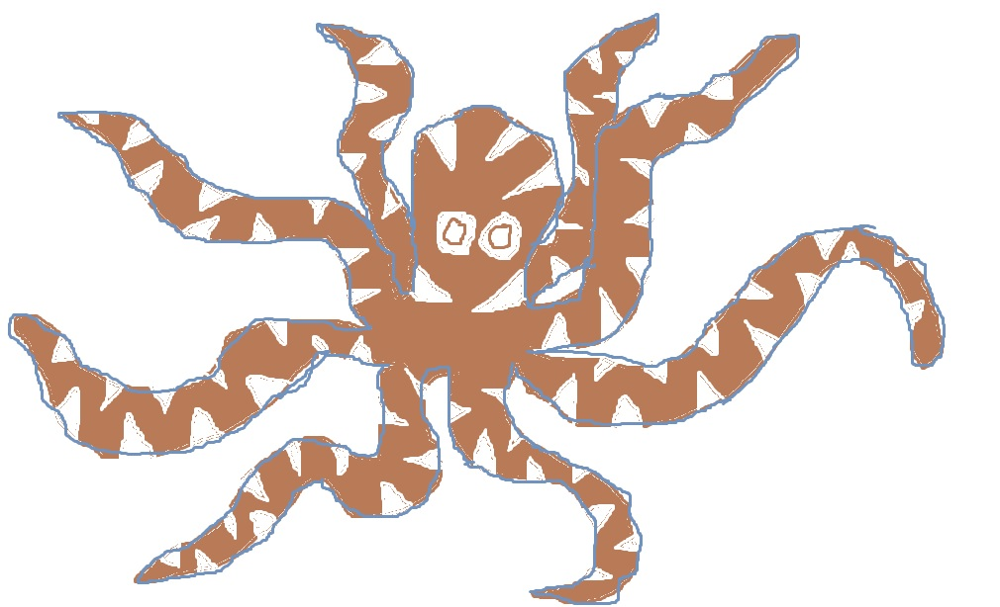

Mimic Octopus
=============

**Fun Facts**

* *Size*: it's a smaller octopus, growing to a length of about 2 feet (including arms).
* *Color*: The natural color of a mimic octopus is light brown, but they usually appear with whitened stripes to scare off predators.
* *Diet*: Hunter/Forager. Eats fish and other smaller prey.
* *Name Origin*: The "mimic" octopus gets its name from its ability to use camouflage and impersonate other aquatic species.
* *Defense*: Besides camouflage, this octopus also changes its shape to help impersonate other creatures.

===========================================================

**Location**

Flying fish are marine fish that are found in all of the oceans. Typically, they're found in tropical and warm subtropical waters. They can be found in the top layer of the ocean that extends downwards from the surface 200 meters.

===========================================================

**An actual flying fish?**

Unlike what its name seems to suggest, the flying fish does not actually fly. Instead, it leaps and glides considerable distances above the surface in order to help the fish avoid predators.

===========================================================

**Predators**

A flying fish has many predators. Creatures that these fish are trying to "fly" away from include mackerel, tuna, swordfish, marlin, and many other larger fish. Unfortunately, even while gliding in the air to avoid predators, the flying fish can become victim to birds as well.

===========================================================

**Cuisine**

Flying fish are caught and eaten in places like Japan, Vietnam, and China. It's a common component of seafood dishes, and is often used to make types of sushi. It's a main source of food in the diet of the Tao people in Taiwan. Flying fish are typically caught while they are gliding by the use of nets.

===========================================================

For more basic info on the flying fish, try this site `here. <http://www.octopusworlds.com/mimic-octopus/>`_

