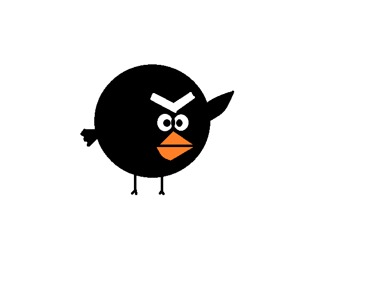

Crow
====

    
**Fun Facts**

* There are about 45 different species of crow
* The common crow lives around seven years
* Crows are considered song-birds
* Crows squish ants and rub it on themselves like perfume
* Crows enjoy sun bathing and receiving the proper amount of Vitamin D
* Crows can count to six
* Crows mate for life
* A group of crows is called a murder

=================================================

**Habitat**

====================================

**Breeding**

 

======================================

**Species**

================  ============   =========
Scientific Name   Common Name    Location
================  ============   =========
Corvus albus      Pied crow      Africa        
Corvus bennetti   Little crow    Australia    
Corvus palmarum   Palm crow      Cuba, Haiti, Dominican Republic       
================  ============   =========
=======
Crow
====

    
**Interesting Facts**

* There are about 45 different species of crow
* The common crow lives around seven years
* Crows are considered songbirds
* Crows squish ants and rub it on themselves like perfume
* Crows enjoy sun bathing and receiving the proper amount of Vitamin D
* Crows can count to six
* Crows mate for life
* A group of crows is called a murder

*Find more interesting facts* `here. <http://www.avesnoir.com/10-amazing-crow-facts/>`_

=================================================

**Habitat**

Crows enjoy having ample amount of space with an
abundance of trees. They also like to live in areas
where they can forage their food. You will likely 
see crows thriving in your neighborhood or nearby 
park. 

====================================

**What Do They Eat?**

Crows are omnivores, meaning they eat plants, as well as
other animals. They really enjoy munching on seeds, fruit
and grains. Every now and then they also consume other birds,
insects, worms mice and even younger rabbits. Crows often prey
on the eggs and nestlings of smaller songbirds.

*Learn more about their diet* `here. <http://www.biokids.umich.edu/critters/Corvus_brachyrhynchos/>`_

======================================

**Species**

=================  ============   =========
Scientific Name    Common Name    Location
=================  ============   =========
Corvus albus       Pied crow      Africa        
Corvus bennetti    Little crow    Australia    
Corvus palmarum    Palm crow      Cuba, Haiti, Dominican Republic 
Corvus ossifragus  Fish crow      SE United States coast   
Corvus palmarum    Palm crow      Cuba, Haiti, Dominican Republic  
Corvus mellori     Little raven   SE Australia
Corvus tasmanicus  Forest raven   Tasmania   
=================  ============   =========

*A more extensive list can be found* `here. <https://en.wikipedia.org/wiki/List_of_Corvus_species>`_
