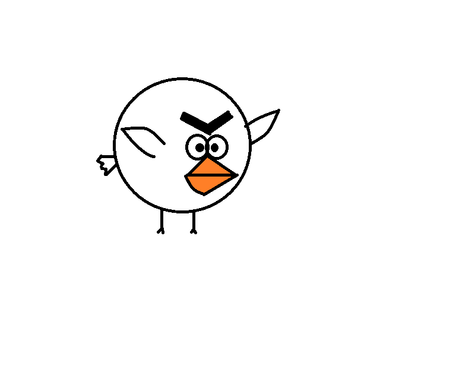

Seagull
=======

**Fun Facts**

* Seagulls actually prefer freshwater over sea water.
* Seagulls have better vision than humans. They are one of the few birds with eyes that move in their socket.
* Seagulls have a well-developed communication system.
* The seagull is the state bird of Utah.
* Seagulls enjoy ruining family picnics. 
=================================================

**Habitat**

* The sea
* The beach
* Coastal areas
* Dumpsters and parking lots of fast food restaurants

====================================

**Breeding**

 

======================================
    
=======
Herring Gull
=======

**Interesting Facts**

* Herring gulls are the quintessential "seagulls"
* Seagulls actually prefer freshwater over sea water
* Seagulls have better vision than humans. They are one of the few birds with eyes that move in their socket
* Seagulls have a well-developed communication system
* The seagull is the state bird of Utah
* Seagulls enjoy ruining family picnics
* There are two dozen different species of gulls living in North America
* The oldest recorded Herring Gull lived to be over 29 years old

=================================================

**Habitat**

* The sea
* The beach
* Coastal areas
* Dumpsters and parking lots of fast food restaurants such as Long John Silver's
* Fish-processing plants 
* Airport runways
* City rooftops

====================================

**What Do They Eat?**

Herring Gulls prey on marine invertebrates, fish, insects, and even other gulls.
They enjoy devouring mussels, crabs, sea urchins, and crayfish along the beach. 
Herring Gulls won't think twice about swiping that bologna sandwich you set down
on your blanket. 

*Learn more about their diet* `here. <https://www.allaboutbirds.org/guide/Herring_Gull/lifehistory#at_food/>`_

======================================

**Conservation**

Herring Gull populations declined by over 3.5% per year between 1966 and 2015. This 
is a cumulative decline of roughly 83%, according to the North American Breeding Bird
Survey. It is listed as a "Species of Low Concern." Oil pollution, pesticide contamination,
and other harmful factors have threatened some populations. 

*The full conservation report can be read* `here. <https://www.allaboutbirds.org/guide/Herring_Gull/lifehistory#at_consv/>`_

======================================
    
    