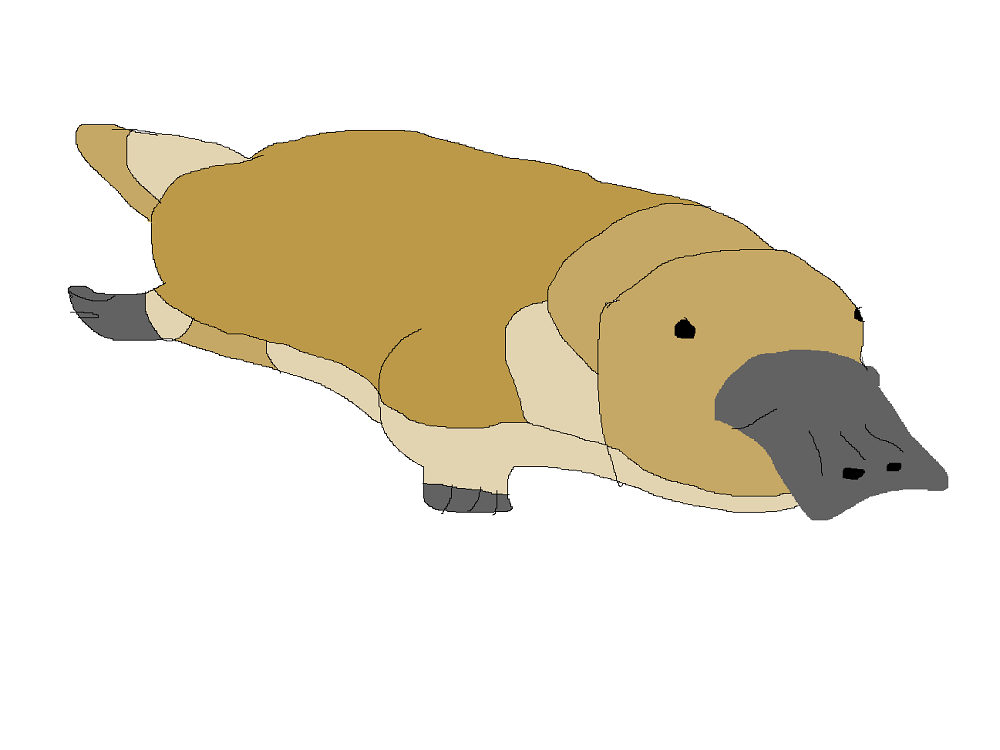

Platypus
========

**Fun Facts**

* *Type*: Mammal.
* *Size*: Full-grown pangolins can grow anywhere between 30 and 100 CM. 
* *Weight*: Between 3 and 33 KG, depending on the species.
* *Color*: Tan or dark brown. Usually covered in dirt. 
* *Diet*: Carnivore. Eats mainly termites, ants, and other insects. One interesting fact about their diet is that they usually stick with a certain species of ant or insect, rarely branching to eat others.

===============================================================================

**Unique Features**

When pangolins are born, the scales on their back are soft and white. However, within a couple of days, the scales grow harder and darker, eventually becoming brown like their parents'. The scales are made of the same material that human nails are made. Imagine having your back covered in plates of fingernails!

The pangolins use these plates when frightened, as they curl themselves up in a ball. These scales are so hard, even lions cannot bite through them. These scales are what makes pangolins extremely valuable. They are the most hunted animal in Africa for this very reason.

===============================================================================

**Location**

Pangolins make their homes in Africa, preferring sandy soils and savannas. Try saying that five times fast! They are most located in central and southern Africa regions. 

===============================================================================

**Reproduction**

Pangolins mate usually during the summer and fall, but there isn't a specific mating season for them. There is a gestation period of around 140 days until a single baby pangolin is born. They are born at around 12 ounces and 6 inches in length.

===============================================================================

For more information on the pangolin, check out this site `here. <http://savepangolins.org/what-is-a-pangolin/>`_ 