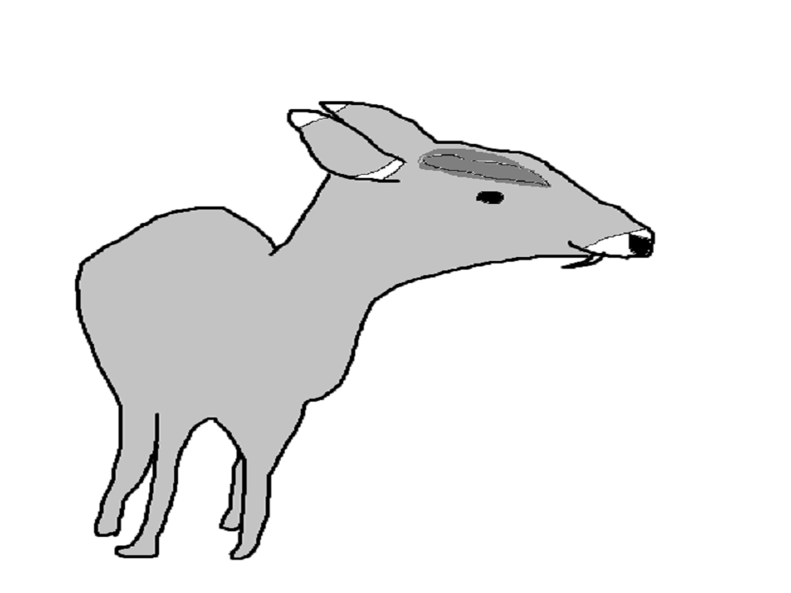

Tufted Deer
===========

**Fun Facts**

* *Type*: Mammal.
* *Size*: Full-grown tufted deer vary between 110-160 CM from head to tail. Adults can grow up to 70 CM from their feet to their shoulders.
* *Weight*: Varies between 17 to 50 KG.
* *Color*: Brown or gray, usually darker in color.
* *Diet*: Herbivore. Eats grass, berries, bamboo, and herbs.
* *Unique Features*: Tufted Deer, as their name suggests, have a "tuft" of fur on their foreheads that stick out from the rest of their body. In addition, both male and female tufted deer have a unique set of canines that protrude from their mouths and over their bottom lips, with the male's canines growing up to 2.5 CM long.

===============================================================================

**Location**

Tufted deer are located around the eastern Asian region, usually appearing in China. More specifically, they prefer to inhabit damp forests and areas near a freshwater supply.

===============================================================================

**Reproduction**

While students are worrying about final projects and tests, tufted deer are holding their mating season. Tufted deer mate between late fall and early winter, often producing just 1 child, although twins aren't too rare. The males use barking noises to communicate to the females that they are ready to mate. After a gestation period of around 180 days (toward the beginning of summer), the fawn(s) are born.

===============================================================================

For more information on the tufted deer, check out this site `here. <http://eol.org/pages/308480/details>`_